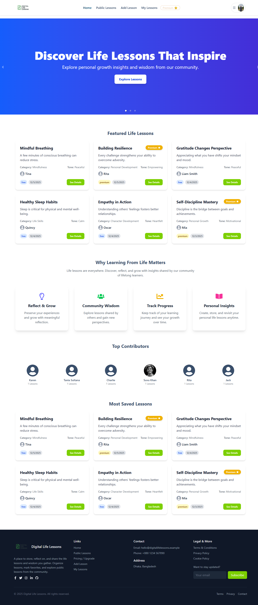

  

# 🌱 Digital Life Lessons

🔗 **Live Website:** https://digital-life-lessons-to-learn.netlify.app

Digital Life Lessons is a reflective platform where users can create, save, and share meaningful life lessons, personal insights, and wisdom gained through real-life experiences. The goal is to help people preserve valuable lessons, grow mindfully, and learn from others.

---

## ✨ Key Features

- 📝 **Create & Share Life Lessons**  
  Users can write detailed life lessons with categories, emotional tones, images, and privacy settings.

- 🔐 **Authentication & Role-Based Access**  
  Secure login system with Free, Premium, and Admin roles using JWT authentication.

- ⭐ **Favorites & Likes System**  
  Users can like lessons and save their favorite lessons for quick access.

- 🛡️ **Admin Moderation Dashboard**  
  Admins can manage all lessons, delete inappropriate content, feature lessons, review reports, and filter lessons by category or visibility.

- 🚩 **Report & Review System**  
  Users can report inappropriate lessons, and admins can review and mark reports to keep the platform clean.

- 💎 **Premium Content Control**  
  Premium lessons are accessible only to premium users, encouraging high-quality paid content.

- 📱 **Fully Responsive Design**  
  Optimized for mobile, tablet, and desktop devices using Tailwind CSS.

---

## 🛠️ Tech Stack

- **Frontend:** React, Tailwind CSS, React Hook Form, TanStack Query
- **Backend:** Node.js, Express.js, MongoDB
- **Authentication:** Firebase Auth + JWT
- **Image Hosting:** ImgBB
- **UI Components:** DaisyUI

---

## 📌 Purpose of the Project

People often learn powerful life lessons but forget them over time.  
Digital Life Lessons helps preserve personal wisdom, encourages reflection, and allows users to grow by learning from others' experiences.

---

## 📬 Contact

If you have any suggestions or feedback, feel free to reach out.

Happy Learning 🌟
